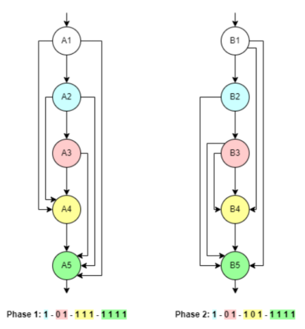

# GeneticCNN - Tìm kiếm kiến trúc mạng CNN bằng giải thuật di truyền

## Datasets 

1. Sử dụng bộ dữ liệu cifar10
2. Dữ liệu sẽ được tự động tải về và đặt vào thư mục `./data/`.


<!-- -------------------------------------------------------- -->
## Sử dụng
1. Import class Population
```python
from genetic_algthm.population import Population
```
2. Khởi tạo một quần thể với các tham số tùy chọn phù hợp với bộ dữ liệu
```python
pop = Population(num_individual=8, num_phase=3, num_conv=19, num_epochs=7)
```
3. Tạo vòng lặp tiến hóa
```python
num_generation = 10
for g in range(0, num_generation):
    pop.set_epoch(g)
    pop.crossover(0.5)
    pop.mutate(0.001)
    pop.select()
```
4. Lưu và tải checkpoint(optional)

```python
pop.save_checkpoint("./pop_checkpoint_path", "./fitness_checkpoint_path")
```

```python
pop = Population(..., pop_checkpoint="pop_checkpoint_path", fitness_checkpoint="fitness_checkpoint_path")
```
## Kết quả
Tìm kiếm kiến trúc trên mô hình gồm 2 giai đoạn, mỗi giai đoạn gồm 5 lớp CNN như hình


Kết quả thu được:

* Độ chính xác 65.63%




## Tài liệu tham khảo
* [Genetic CNN](https://openaccess.thecvf.com/content_ICCV_2017/papers/Xie_Genetic_CNN_ICCV_2017_paper.pdf)